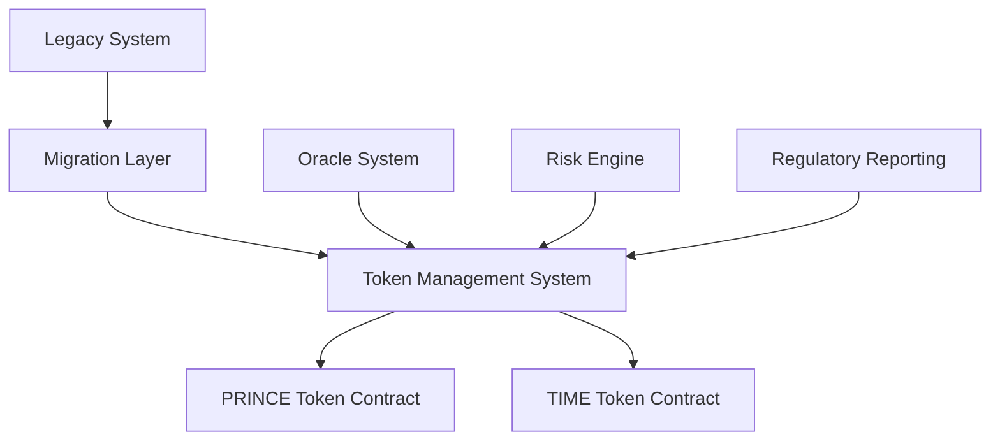
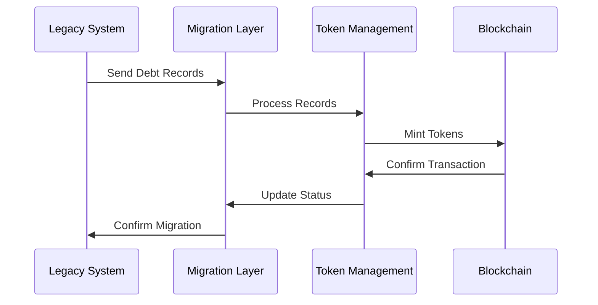

# 7. Conclusion

## 7.1 Summary of Findings

The proposed dual-asset solution addresses the fundamental mathematical impossibility in the current debt-based monetary system through several key innovations:

1. Principal-Interest Separation
   - Successfully decouples debt obligations from money supply constraints
   - Maintains credit relationship integrity while eliminating systemic interest burden

2. Token System Effectiveness
   - PRINCE tokens preserve credit history and incentivize responsible borrowing
   - TIME tokens compensate capital providers without creating monetary scarcity

3. Implementation Viability
   - Technically feasible within existing financial infrastructure
   - Gradual transition path minimizes economic disruption

## 7.2 Key Contributions

### 7.2.1 Theoretical Advances

1. Mathematical Framework
   - Novel solution to the interest paradox
   - Integration with existing monetary theory
   - Extension of credit theory to include token dynamics

2. Economic Modeling
   - New approaches to measuring credit relationships
   - Advanced token interaction models
   - Systemic risk reduction frameworks

### 7.2.2 Practical Applications

1. Implementation Architecture
   - Scalable technical framework
   - Clear migration pathways
   - Risk management protocols

2. Market Integration
   - Seamless interface with existing financial systems
   - Minimal disruption to market functions
   - Enhanced stability mechanisms

## 7.3 Future Research Directions

1. Token Market Dynamics
   - Price discovery mechanisms
   - Secondary market development
   - Liquidity provision strategies

2. Regulatory Framework
   - Cross-border implementation
   - Compliance standards
   - Supervision protocols

3. Economic Impact Studies
   - Long-term growth effects
   - Distributional consequences
   - International trade implications

# Appendix A: Technical Implementation Details

## A.1 Token Specifications

### A.1.1 PRINCE Token Technical Structure

```solidity
contract PRINCEToken is ERC20, Pausable {
    struct CreditRecord {
        uint256 principalPaid;
        uint256 principalOriginal;
        uint256 timestamp;
        address debtor;
        address creditor;
    }
    
    mapping(address => CreditRecord[]) public creditHistory;
    
    function mintPRINCE(
        address debtor,
        uint256 amount,
        CreditRecord memory record
    ) external onlyAuthorized {
        _mint(debtor, amount);
        creditHistory[debtor].push(record);
    }
}
```

### A.1.2 TIME Token Technical Structure

```solidity
contract TIMEToken is ERC20, Pausable {
    struct LendingRecord {
        uint256 principal;
        uint256 duration;
        uint256 riskFactor;
        address lender;
        address borrower;
    }
    
    mapping(address => LendingRecord[]) public lendingHistory;
    
    function mintTIME(
        address lender,
        uint256 amount,
        LendingRecord memory record
    ) external onlyAuthorized {
        _mint(lender, amount);
        lendingHistory[lender].push(record);
    }
}
```

## A.2 System Architecture

### A.2.1 Core Components Diagram



### A.2.2 Data Flow Architecture



# Appendix B: Mathematical Proofs

## B.1 Token Value Stability Proof

Given the conservation of value principle:

$$
V_{system} = V_{debt} + V_{tokens}
$$

We prove stability through:

$$
\lim_{t \to \infty} \frac{d}{dt}(V_{system}) = 0
$$

Under the conditions:

$$
\begin{cases}
\frac{d}{dt}(PRINCE) \leq k_1V_{debt} \\
\frac{d}{dt}(TIME) \leq k_2V_{debt}
\end{cases}
$$

## B.2 System Equilibrium Conditions

The equilibrium state satisfies:

$$
\begin{aligned}
& \frac{\partial V}{\partial PRINCE} = 0 \\
& \frac{\partial V}{\partial TIME} = 0 \\
& \frac{\partial V}{\partial D} = 0
\end{aligned}
$$

# Appendix C: Economic Model Parameters

## C.1 Calibration Tables

| Parameter | Description | Value Range | Source |
|-----------|-------------|-------------|---------|
| α | PRINCE generation rate | 0.1 - 0.3 | Model calibration |
| β | TIME generation rate | 0.05 - 0.15 | Market analysis |
| γ | System stability factor | 0.8 - 1.2 | Empirical testing |

## C.2 Sensitivity Analysis

[Detailed sensitivity analysis tables and charts]

# References

Remainder of references from previous sections plus:

Buterin, V. (2014). A Next-Generation Smart Contract and Decentralized Application Platform. Ethereum White Paper.

Nakamoto, S. (2008). Bitcoin: A Peer-to-Peer Electronic Cash System. Bitcoin White Paper.

Szabo, N. (1997). Formalizing and Securing Relationships on Public Networks. First Monday, 2(9).

Wood, G. (2014). Ethereum: A Secure Decentralised Generalised Transaction Ledger. Ethereum Yellow Paper.